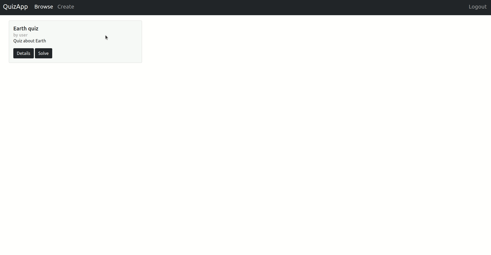

# QuizzApp
Web app that allows users to create, store, access and solve quizzes (quizzes consist of arbitrary amount of multiple-choice questions). Logged users sore their anser statistics on the server and can tag questions as memorized/needs-to-review.

## Technology Stack

### Data Base
Mongo.db and Spring Data  
[Detailed collection descriptions](/backend/COLLECTIONS.md)

#### Collections 

#### `users`
stores user data.

#### `quizzes`
stores quiz data.  
(title, description, author, visibility, questions with answers)

#### `quizstatistics`
stores quiz statistics for a single quiz.   
(tag, number of correct and wrong answers for every question in the quiz)

### Server
Java Spring Boot  
rest api server - [Endpoinds Documentation](/backend/ENDPOINTS.md)

### Frontend
React.js (in typescript)  

## Features
### Authentication
Users can create accounts by providing unique username and password.  
App uses Basic Htttp Authorization  and stateless sessions - authorization data has to be sent in every authorized request.
  Users without accounts can:
 * browse public quizzes
 * solve public quizzes - statistics will still be gathered and displayed, but not presisted.
 * login/signup

### Quiz creation and modification
Authenticated user can create end edit quizzes via interactive forms.

### Private quizzes
Users can make a quiz private to hide it from other users.

### Solving quizes ond statistics
Users can solve quizzes and see their statistics.

